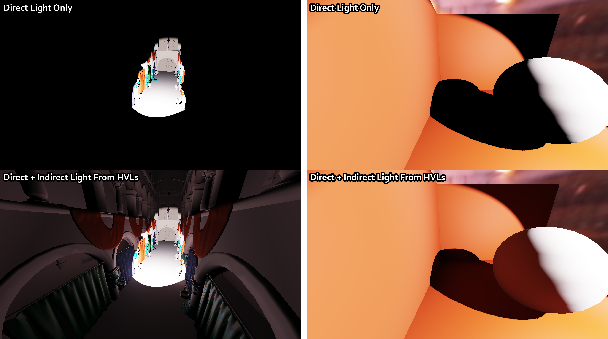
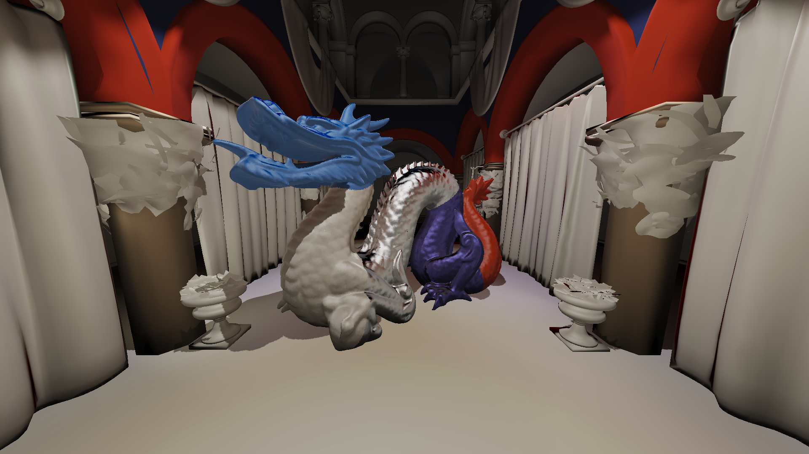

# Harmonics Virtual Lights
A Vulkan implementation of the paper "Harmonics Virtual Lights: Fast Projection of Luminance Field on Spherical Harmonics for Efficient Rendering" (https://doi.org/10.1111/cgf.14564) for my bachelor thesis project. The technique approximates global illumination in real-time with virtual lights. The virtual light sources make use of spherical shapes and utilize spherical harmonics for fast light projection and integration, rather than relying on traditional numerical schemes.

# Screenshots

# Vulkan features used
* Version 1.3
* Dynamic rendering
* Synchronization 2
* Push descriptors

# Assets used
* MERL BRDF database: https://cdfg.csail.mit.edu/wojciech/brdfdatabase
* Code for efficient SH evaluation: https://jcgt.org/published/0002/02/06/
* HDR skybox (Grace Cathedral): https://www.pauldebevec.com/Probes/
* Sponza model: https://github.com/jimmiebergmann/Sponza
* Dragon model: http://graphics.stanford.edu/data/3Dscanrep/

# Libraries and APIs used
* Dear ImGUI: GUI for debugging
* EnTT: entity components system
* fast_obj: OBJ mesh importing
* GLFW: window management
* GLM: math
* stb: image importing
* Vulkan: graphics and GPU management
* Vulkan Memory allocator: GPU memory management
